This article will attempt to explain why certain angles have to be used when strafe-jumping, and why strafe-jumping is necessary in the first place. It is aimed at those who already have a practical knowledge of strafe-jumping, and wish to know more about what is really going on. Although this article is based on Quake 3, the theory may be applied to many games, especially those based on Quake engines.

If you enjoyed this article, you may be interested in its sequel, [Circle-Jump Theory](circle-jumping-theory.md).

Firstly, you should know that there is one important difference between standing on a surface and being airborne, that is a surface has friction. Therefore if you are in contact with a surface and you stop providing movement (i.e. release all keys) then the frictional force will decelerate your movement to zero. In the air there is no friction, and so as long as you are not in contact with another object, when you release all keys your speed will remain constant.

In-game, a player has control of two key things: their orientation, and the movement keys being pressed. The movement keys can provide acceleration; the combination of movement keys, and the orientation of the player, determines which direction the player wishes this acceleration to be applied in.

For example, by holding Forwards and Right Strafe, the player's acceleration vector, $\underline{\mathbf{a}}$, looks like this:

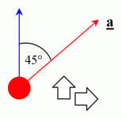

It is this acceleration, provided by the movement keys, which gives the player a change in velocity, which ultimately changes his position.

However, the Quake 3 engine tries to limit your 'speed' to $320$ ups by the server variable $\mathbf{g\textunderscore speed}$. The engine doesn't allow you to accelerate past this $320$ ups in any one direction. Indeed, if you are travelling through the air at $320$ ups (or greater) and you hold the Forwards key (while facing the direction of travel) nothing will happen, because the engine is enforcing this limit, whether you are running or flying. So you have to use strafe-jumping to accelerate past $320$ ups.

Before I go any further, I will remind you of the following definitions:

_**Vector** = A quantity which has both a size and direction.  
**Velocity** = A vector consisting of speed and direction of speed.  
**Acceleration** = The rate of change of velocity with time. Therefore it is also a vector. The acceleration accounts for both the change in speed, and change in direction of the velocity._

So let's look at what happens when you are strafe-jumping. In all techniques, you need to be in the air at all times to avoid the friction caused by surfaces. This is the reason why players repeatedly jump, and this repeated jumping is known as bunny-hopping.

The first example technique is of standard **single-beat** strafing.

There are two air 'modes' involved in single-beat strafing, one being a mirror image of the other. In both modes, the player is orientated at an angle to the direction of travel. We shall call this angle **theta**, $\theta$. At the same time, the player is holding **Forwards** and either **Left Strafe** for the left mode, or **Right Strafe** for the right mode. This results in the following situation.

 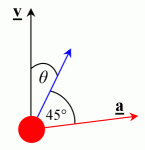

The black arrow is the **velocity** vector, which illustrates the **direction in which the player is currently moving**.  
The blue arrow is the **orientation** of the player (the direction in which you are **looking**).  
The red arrow is the **acceleration** vector.

To perform the technique, the player quickly switches between modes (called an 'air-change') and continues alternating in this fashion by air-changing at (usually) regular intervals, usually in time with a jump.

Now keeping this in mind, let's look at the other distinctive strafing technique: half-beat strafing. You will see that half-beat strafing is actually the same thing as single-beat strafing, it's just another way to perform it.

Like single-beat, there are two air modes in half-beat. For lack of better terms, I shall name them 'first mode' and 'second mode'.

 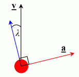

The first mode is exactly the same as the 'left mode' from single-beat. The second mode appears a little strange at first. In this mode, the player is again orientated to the left of the direction of travel, by a small angle, which I have named angle **lambda**, $\lambda$. At the same time, the player is holding **Right Strafe only**.

Now if you look back at the single-beat diagrams and compare them with these half-beat diagrams, you can see that the acceleration vectors (red arrows) are exactly the same in both techniques! There is a red arrow to the left in both the strafing techniques followed by one to the right. Plus, these acceleration vectors are all at the same angle to the velocity (use your imagination if necessary).

Indeed, it's possible to strafe in a number of ways, by using any combination of keys-presses and orientations in order to apply acceleration vectors in the way illustrated above. They are all equivalent, although some are more difficult to humanly perform than others.

Now let's look at why this angle between our velocity and acceleration is significant. We already know that the engine won't allow a player to gain speed in the direction of travel using the movement keys. However, we CAN gain speed in another direction, as long as our velocity's component is less than $320$ ups in that specific direction.

So when we try to apply an acceleration at some angle to the velocity, we will be allowed to accelerate provided that the component of our current velocity in the proposed direction is less than $320$ ups. Mathematically, this is as follows.

Let's call this angle between our velocity and acceleration angle **delta**, $\delta$.

The component of the velocity in the direction of the acceleration is given by

$$\underline{\mathbf{v}} \cdot \underline{\mathbf{\hat{a}}} = v \cos \delta$$

<!-- . -->

This can be thought of as the projection of the velocity onto the direction of $\underline{\mathbf{a}}$.

As described above, the condition for acceleration to be allowed is

$$v \cos \delta < 320$$

<!-- . -->

Note that when $v \cos \delta$ is negative, this means you are applying an acceleration in a direction at more than $90 \degree$ to the velocity, which means you are effectively opposing your current velocity, a braking effect[\*](#note).

<!-- Note that when  is negative, this means you are applying an acceleration in a direction at more than 90º to the velocity, which means you are effectively opposing your current velocity, a braking effect[\*](#asterisk). -->

The size of the acceleration applied, $a$, is a constant, independent of the angle at which it is applied (in the allowed region). This is defined by the engine in the same way that jump velocity and friction (etc.) are defined. However there is one special case which is an exception to this rule. If your $v \cos \delta$ is less than $320$ but still very close to $320$, applying the usual constant acceleration for a single frame would be enough to take you over $320$ ups in that direction. This is something the engine checks for, and if the situation exists, the applied acceleration will be only enough to take you up to the $320$ ups limit (so it would be $320 - v \cos \delta$), and not beyond. However, the range of angle delta at which this situation exists is very small.

<!-- The size of the acceleration applied, a, is a constant, independent of the angle at which it is applied (in the allowed region). This is defined by the engine in the same way that jump velocity and friction (etc.) are defined. However there is one special case which is an exception to this rule. If your  is less than 320 but still very close to 320, applying the usual constant acceleration for a single frame would be enough to take you over 320ups in that direction. This is something the engine checks for, and if the situation exists, the applied acceleration will be only enough to take you up to the 320ups limit (so it would be ), and not beyond. However, the range of angle delta at which this situation exists is very small. -->

The acceleration causes a change in the total velocity, which is made up of a **change in speed** and a **change in direction** (remember that velocity is a vector). Although the amount of acceleration, $a$, is a constant, the direction that it is applied in dictates how much of this acceleration goes into changing the speed, and how much goes into changing the direction. In strafe-jumping it is the **change in speed** that we are interested in **maximising**, in an increasing fashion.

The way to achieve this maximum increase in speed is by applying the acceleration so its direction is as close to that of the velocity as possible, i.e. so the angle delta is as small as possible. This will mean that more of the acceleration goes into increasing our speed, and less goes into affecting the direction. The limiting condition gives a minimum angle delta of

$$\delta_{min}=\arccos\left(\frac{320}{v}\right)$$

<!-- . -->

However in order to gain the full acceleration, $a$, we need the angle to be a bit larger, so we avoid the special case mentioned above. Therefore the optimal angle is the smallest angle at which we receive the full acceleration, $a$, which is given by

$$\delta_{opt}=\arccos\left(\frac{320-a}{v}\right)$$

<!-- . -->

As you can see, this optimal angle is dependent on the speed, $v$. This means that the optimal angle increases as you speed up, tending towards $90 \degree$ at infinity.

Now that we know how acceleration is applied, we can look at the effect it has on the velocity, and the new velocity that results.

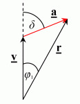

This acceleration, $\underline{\mathbf{a}}$, causes the current velocity, $\underline{\mathbf{v}}$, to change and produces a resultant velocity, $\underline{\mathbf{r}}$. We can use basic trigonometry to calculate the size and change in direction of the resultant velocity. The change in direction also illustrates why strafe-jumping can cause the player to 'drift' to one side if the strafing is not consistent.

The results of these calculations are here for the mathematically-gifted; however it's not necessary to understand the following. From now on I shall use the parameter $s$ to refer to the value of g_speed. First let's look at the resultant speed after one frame. Note that there are three regions where acceleration is applied differently and hence the resultant speed is given by the following piecewise function.

$$
r = \begin{cases}
  \sqrt{v^2 + a^2 + 2va\cos\delta}\text{, } &\ v\cos\delta \leq s-a \\
  \sqrt{v^2\sin^2\delta+s^2}\text{, } &\ s-a \le v\cos\delta \le s \\
  v\text{, } &\ v\cos\delta \geq s
\end{cases}
$$

<!-- 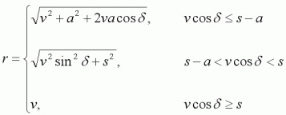 -->

The acceleration per frame, $a$, is defined (for air) by the engine as

$$a=sT$$

<!-- , -->

where $T$ is the frame-time in seconds. So for a constant $125$ fps framerate and standard $\mathrm{g\textunderscore speed}$ of $320$, then $a=2.56$ ups per frame.

<!-- where $T$ is the frame-time in seconds. So for a constant $125$ fps framerate and standard $\text{g\_speed}$ of $320$, then  ups per frame. -->

The best way to interpret this is graphically. Here is a graph of the speed gained in a single frame, as a function of the applied angle delta.

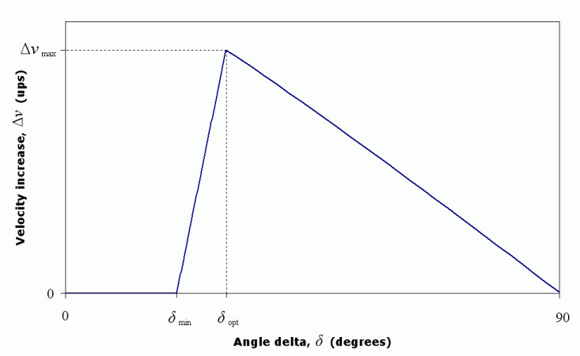

Although this graph looks triangular, the two curves are not actually straight lines, but as you can see, for all intents and purposes they can be thought of as straight lines. Also note that the spacing between the minimum and optimal delta angles has been exaggerated in the graph, and so the increase in speed drops off very quickly as angle delta is decreased from its optimal value.

This makes it highly important to ensure that any applied angle delta is not too small. It's not so bad if the angle is a little larger than optimal, but if it is smaller than optimal, the consequences are much greater. Also remember that both the minimum and optimal angles are velocity-dependent, so they both move closer to $90 \degree$ (and closer to each other) as the velocity increases. During normal strafe-jumping these two angles are separated by less than $0.3 \degree$, so you can imagine how steep that part of the graph above really looks. There is, therefore, a very fine line between an optimal and zero speed increase.

If we apply an optimal angle delta, we get a resultant velocity of

$r=\sqrt{v^2-a^2+2as}$

<!-- , -->

which we can use to graph the **maximum increase in speed per frame**:

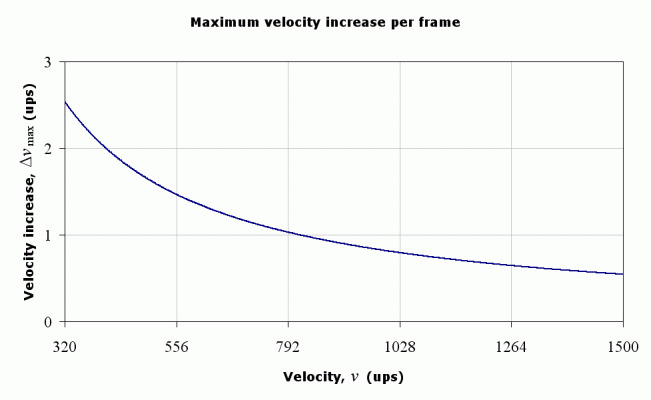

This graph illustrates how you cannot increase your speed as much at high velocites as you can at lower velocities.

Now we shall look at the change in direction. Let angle phi-one, $\phi_1$, be the change in direction due to one frame of acceleration, at our optimal delta angle.

$$\varphi_1=\arctan\left(\frac{a\sqrt{v^{2}-\left(s-a\right)^{2}}}{v^{2}+a\left(s-a\right)}\right)$$

<!--  -->

When strafing, the direction in which you are travelling is **always changing**. However, you cannot see the direction that your velocity is pointing in, and it's difficult to guess accurately just by looking, so it can be very difficult to apply the optimal angle delta unaided.

It is much more useful to know the angle that we must apply relative to the overall direction in which we are trying to move in, e.g. from the beginning of a strafe pad lane to the end. I shall refer to this direction as the 'direction of overall motion'.

To do this, we need to consider how much our velocity direction changes from one bunny-hop to the next. Let angle phi, $\varphi$, be the total change in direction caused by strafing between air-changes.

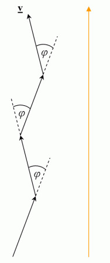

If we analyse the change in direction per frame, we see that not only is it small, but it also doesn't change much over the period between air-changes, provided that the velocity is greater than about $600$ ups. This is useful to us, since $600$ ups is roughly the boundary between the end of a circle-jump, and the beginning of strafe-jumping. This is also the reason why the technique used for circle-jumps needs to be different to strafe-jumping.

We can use this to gain an expression for the change in direction between air-changes.

$$\varphi \approx N \langle \varphi_1 \rangle$$

<!--    -->

Phi is the change in direction between air-changes. N is the number of frames between air-changes. $\langle \varphi_1 \rangle$ is the average change in direction per frame. \[Using standard gravity ($800$) and $125$ fps, there are about $88$ air-frames between bunny-hops.\]

<!-- Phi is the change in direction between air-changes. N is the number of frames between air-changes.  is the average change in direction per frame. \[Using standard gravity (800) and 125fps, there are about 88 air-frames between bunny-hops.\] -->

$$\varphi \approx N\arctan\left(\frac{a\sqrt{v^{2}-\left(s-a\right)^{2}}}{v^{2}+a\left(s-a\right)}\right)$$

<!--  -->

Therefore we can take this change in direction into account, and specify the strafing angles **relative to the fixed direction of overall motion**, rather than giving them relative to the velocity direction, which is always changing.

First let's define angle alpha, $\alpha$, as the angle between the direction of overall motion and the optimal acceleration direction, at an air-change.

$$\alpha=\frac{\varphi}{2}+\delta_{opt}$$

<!--  -->

Then we can go on to apply this to the different strafing techniques.

The first strafing angle I shall call angle **epsilon**, $\varepsilon$. This is the angle that is used to implement an optimal angle theta, used in **single-beat** strafing and for the 'first mode' of half-beat. (Here the orange arrow is the direction of overall motion)

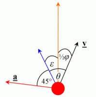

Angle epsilon is thus,

$$\varepsilon = \alpha - 45\degree$$

<!-- . -->

If we look at the graph of angle epsilon, we can see that the angle **increases** as we speed up.

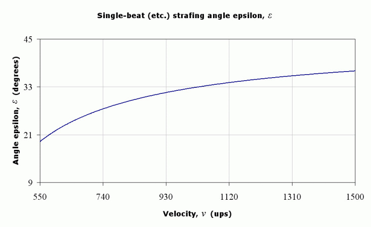

The other strafing angle I shall call angle **kappa**, $\kappa$. This is the angle that is used to implement an optimal angle lambda, used for the 'second mode' of **half-beat**.

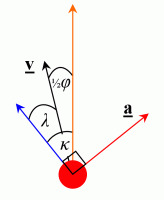

Angle kappa is thus,

$$\kappa = 90 \degree - \alpha$$

<!--  -->

Looking at the graph of angle kappa, we can see that angle kappa becomes smaller as we speed up, and is smaller in general than angle epsilon.

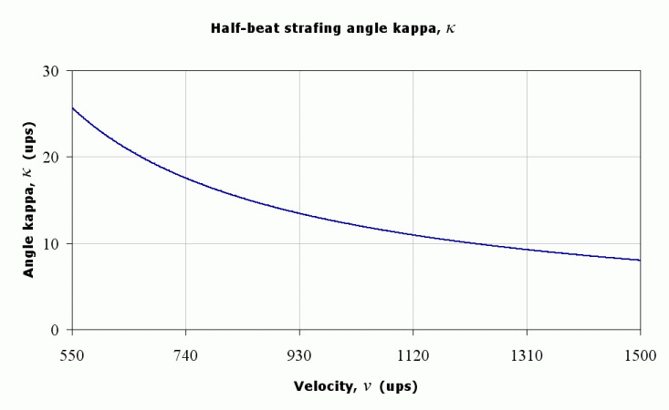

In short, the strafing angle for single-beat (epsilon) begins at about $22 \degree$ and increases. It's about $33 \degree$ at $1000$ ups. The half-beat angle (kappa) begins at about $23 \degree$ and decreases. It's about $12 \degree$ at $1000$ ups.

# Note

There is a small angle by which angle delta can exceed $90 \degree$ and still result in a speed increase. The maximum angle delta is given by

$$\delta_{max}=\arccos\left(\frac{-a}{2v}\right)$$

<!-- . -->

This is the boundary between a speed increase and a speed decrease.
